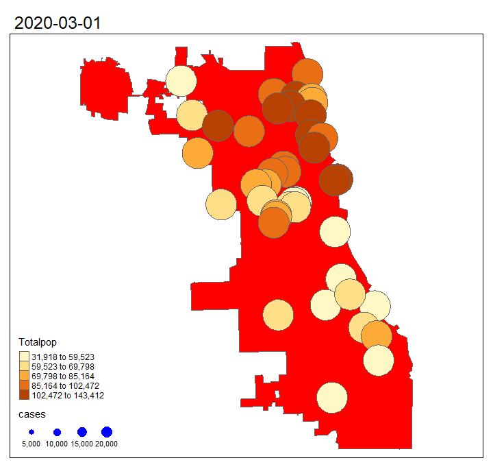

## Objectives
1. Subset census data for a specific census-designated place
2. Perform spatial join operation 
3. Transform coordinate system of vector layers 
4. Generate animated maps as a gif file

## Overview 

Please make sure to install and load the following packages. 

```{r eval=F}
library(sf)
library(tmap)
library(tidycensus)
library(tidyverse)
library(tigris)

```

We have talked about data manipulations before where we can clean and transform tabular data in a proper format. How about spatial data? In this lab, we will introduce some commonly used vector operation functions to clean or change spatial data based on their geometry. To be more specific, let's examine the service of major hospitals in Chicago. How many potential population they can serve under emergency? Is there any pattern of total confirmed COVID-19 cases throughout time in Chicago? 


## 1. Demographic data for city of Chicago

Let's first examine the demographic information for the city of Chicago. We can download the data directly using the `tidycensus` package. We all know that the `get_acs` function can download the data at state / county / tract / zcta levels. So how to move forward analyzing data within the Chicago city boundary only? First let's get the demographic data at Cook county. We keep the geometry as true in order to create maps. 

```{r eval=F}
#census_api_key("Put your key here")
demo_tract <- get_acs(geography = 'tract',variables = c(totPop = "B01001_001",Hispanic ="B03003_003", NOTHispanic = "B03003_002",White = "B02001_002",Afr = "B02001_003",Asian = "B02001_005"), year = 2018, state = 'IL', county="Cook", geometry = T, output="wide")

tm_shape(demo_tract)+tm_polygons(col = "totPopE")
```
 
How can we subset tracts within Chicago only? Another package called `tigris` will allow you to bring in census geographic boundaries at different levels. Make sure you installed this package first before using. Below is a comprehensive list of all the core-based statistical areas included in this package. 

```{r eval=F}
#cb=T allows you to reduce the size of the downloaded shapefile 
all_areas <- core_based_statistical_areas(year = 2018, cb = T)
```

We need extract the outline of Chicago so the `places` function will be helpful here. The function will download a census-designated places as shapefile (outline). The commands below return a simple feature outline for Chicago. 

```{r eval=F}
Chicago_outline <- tigris::places(state = "IL", cb = TRUE, class = "sf") %>% filter(NAME=="Chicago")

tm_shape(Chicago_outline)+tm_polygons(border.col = "black")

```


A common spatial data wrangling question is how can we subset a spatial data based on their location, or how can we spatially join multiple simple features. For example, here we want to keep tracts (simple feature called `demo_tract`) that are within the city of Chicago (simple feature called `Chicago_outline`). For any tract, as far as it intersects with the Chicago city outline, the tract will be returned. Let's try the `st_join` function below:

```{r eval=F}
Chicago_tract <- st_join(demo_tract,Chicago_outline,join = st_intersects, left=FALSE)

```

We need clarify that an intersection is expected by setting `join = st_intersects`. `left=FALSE` will drop any tract polygons which do not intersect with the city of Chicago. Let's plot out the data: we have 874 tracts returned:

```{r eval=F}
tm_shape(Chicago_tract)+tm_polygons(col="totPopE")
```

## 2. 1-mile service area of hospitals

Next let's evaluate the service area of the hospitals in Chicago. You need download the hospital data as shapefile locally from [here](https://data.cityofchicago.org/Health-Human-Services/Hospitals-Chicago/ucpz-2r55). Load the hospital data in R. There are 42 hospitals included as points. 

```{r eval=F}
hospital <- st_read("data/Hospitals.shp")
tm_shape(Chicago_tract) +
    tm_polygons(col = "totPopE")+tm_shape(hospital)+
    tm_dots(size=0.02)
```

Let's set 1 mile as the service area radius of emergencies for each hospital. We will need the `st_buffer` tool. This function calculates buffers as polygons which covering all areas based on the specified distance from the given geometry(point/line/polygon). Based on the description above, we need to create a 1 mile buffer (polygon) as the hospital service area around each hospital (point). 

1. Check the coordinate system information for this hospital data. It has a projected coordinate system NAD83 / Illinois East (ftUS) with the spatial unit as foot. 

```{r eval=F}

head(hospital)

```

2. Create buffer where distance is 5280 feet, which is equivalent to 1 mile in this case. 

```{r eval=F}
hospital_1mile = st_buffer(hospital, dist = 5280)


tm_shape(Chicago_tract) +
    tm_polygons(col = "totPopE")+
  tm_shape(hospital_1mile)+tm_polygons(board.col="black")
```

The map above includes two layers: 1) total population for each tract; 2) 1-mile service area coverage of each hospital. It is still hard for us to evaluate how many potential population it can serve per hospital. To aggregate total population information for each hospital, we need to perform **spatial join** again using the `st_join` function. For any tract who intersects with a hospital buffer, the demographic information will be added to this specific hospital buffer. 

```{r eval=F}
chicago_tract_hospital <- st_join(hospital_1mile,Chicago_tract,join = st_intersects, left=FALSE) 

```

When executing the commands above, you will receive an error message: "st_crs(x) == st_crs(y) is not TRUE". This means we cannot perform a spatial join process when the coordinate system for two layers are not identical. So what are the coordinate systems for these two layers? Try the commands below:

```{r eval=F}
st_crs(hospital_1mile)
st_crs(Chicago_tract)
```

The coordinate system for `hospital_1mile` is NAD83 / Illinois East (ftUS), and the coordinate system for `Chicago_tract` is NAD83. Since we are interested in the total population covered by each hospital buffer, let's transform the coordinate system of tract data into the coordinate system of the hospital buffer. 

```{r eval=F}
system <- st_crs(hospital_1mile)
tract_new <- st_transform(Chicago_tract,system)   
```

Now we can perform the spatial join process. However, for each hospital buffer, it might covers multiple tracts. In this case, we will sum up the total population value for these tracts. In addition, since `st_join` also create a separate row for each intersection(combination), we will need use `group_by` and `summarize` to reduce the duplicated records.

```{r eval=F}
chicago_tract_hospital <- st_join(hospital_1mile,tract_new,join = st_intersects, left=FALSE) %>% group_by(BLDGID) %>% summarise(Totalpop=sum(totPopE))

```

Now we can create a thematic map showing total potential population each hospital can serve within 1-mile straight line distance. 

```{r eval=F}

tm_shape(Chicago_outline) +
    tm_polygons(border.col = "red") +tm_shape(chicago_tract_hospital)+tm_polygons(col="Totalpop",style = "quantile")

```

## 3. COVID-19 cases in Chicago as an animated map

Now let's further examine how does the total confirmed COVID-19 case change throughout time in Chicago. First download the COVID-19 Cases, Tests, and Deaths by ZIP Code data from [here](https://data.cityofchicago.org/Health-Human-Services/COVID-19-Cases-Tests-and-Deaths-by-ZIP-Code/yhhz-zm2v) as a shapefile, then load the data in R. 
```{r eval=F}
chicagoZips_covid <- st_read("data/COVID_zip.shp")

```

The data provides weekly (from March 2020 till now) confirmed cases (`cases_week`) for each home ZIP Code of the cases and people tested. Use the `head` function to preview the data type and key columns. 

```{r eval=F}
head(chicagoZips_covid)
```


This shapefile includes spatial points instead of polygons. Before generating the animated map, let's first aggregate number of cases for each week. 

```{r eval=F}
week_covid <- chicagoZips_covid %>% group_by(date_week_) %>% summarise(cases=sum(cases_week, na.rm = T))

```

Then we can use `tmap` functions to further display number of cases for each zip code point. The size of the point represents number of cases. Use `tm_facets` to generate a set of separate maps by each week.  The `free.coords = FALSE` helps to maintain the map extent for each map layer. Save the entire map object as `COVID_Weekly_ani`. 

```{r eval=F}
COVID_Weekly_ani <- tm_shape(Chicago_outline) +tm_polygons(col = "red") +tm_shape(chicago_tract_hospital)+tm_polygons(col="Totalpop",style = "quantile")+
    tm_shape(week_covid)+ tm_dots(size="cases", col="blue")+tm_facets(along = "date_week_", free.coords = FALSE)

```

Next we can use the `tmap_animation` function to generate a `.gif` file locally as an animated map. The input is the `tmap` object we created above. Set `delay = 50` which represents the delay time between each image in 1/100th of a second. Once done, open the .gif file locally to check the results. 

```{r eval=F}
tmap_animation(COVID_Weekly_ani, filename = "weekly_covid.gif", delay = 50)

```



